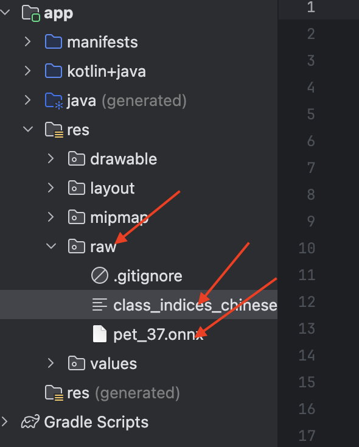
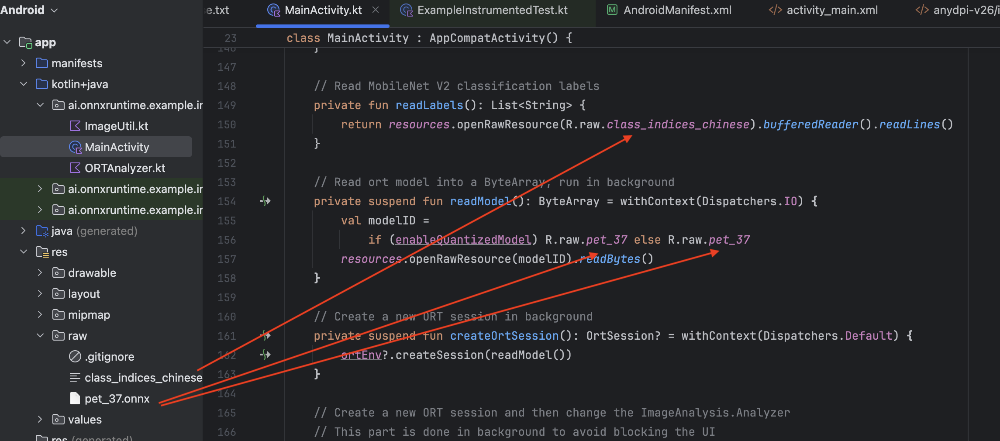
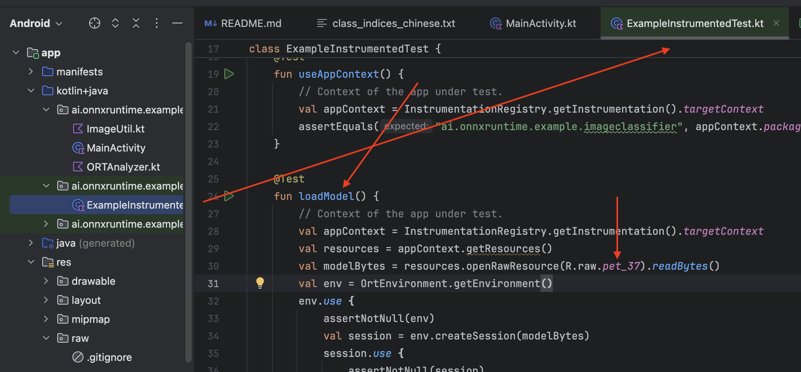
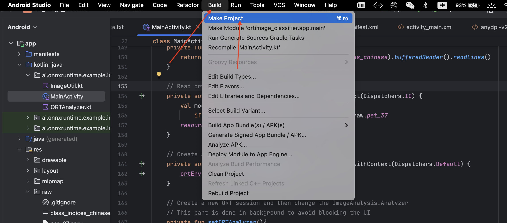
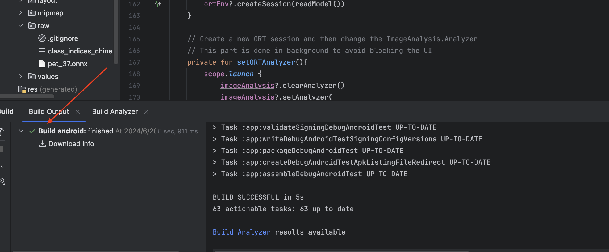
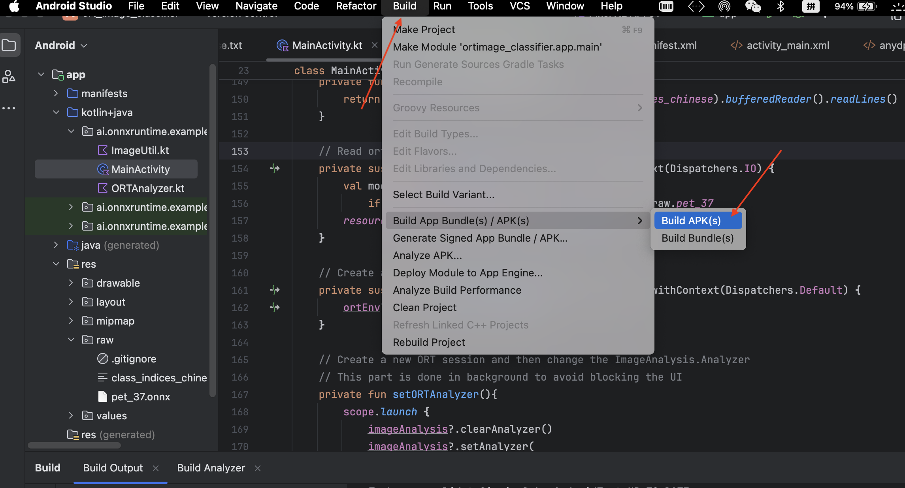
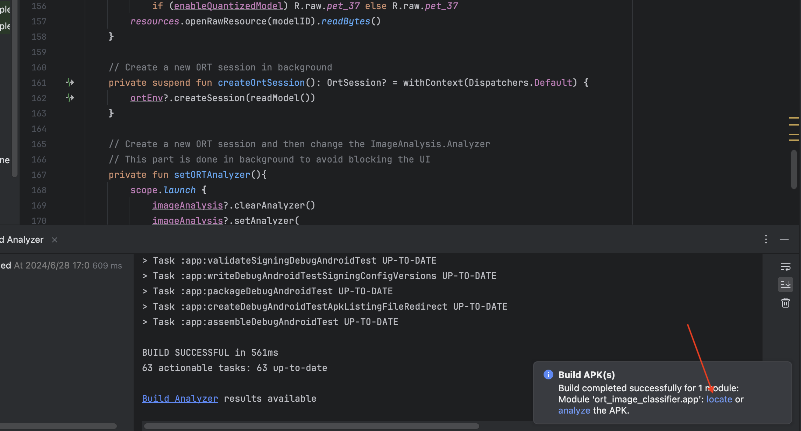
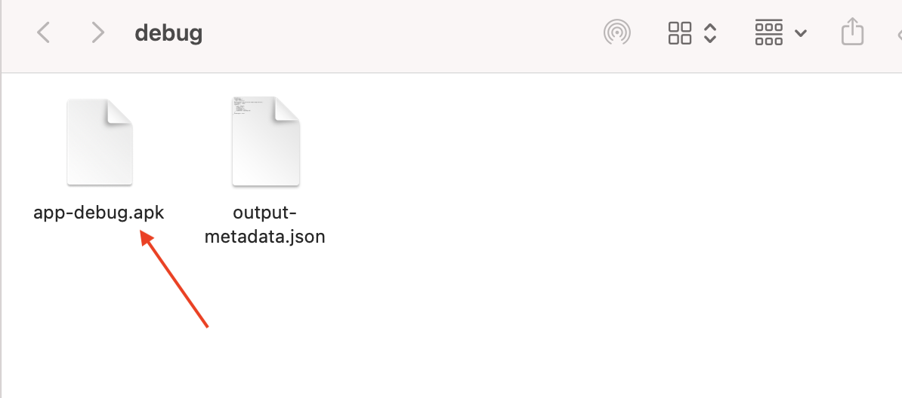

# PET_37
 基于ResNet18网络的宠物分类app
 效果如下：
 
 下面我从模型的训练和部署两个方面讲解一下这个项目。
## 一、模型训练  
### 1、数据集 
#### （1）下载数据集
- 由于该项目数据集文件太大所以该项目并不提供数据集。
- 如果你要自己训练请自行下载该数据集，该数据集你可以从官网：https://www.robots.ox.ac.uk/~vgg/data/pets/ 下载，下载后将数据集替换oxford-iiit-pet即可。  
- 如果你只想使用app你也可以使用我的apk安装包。请直接跳转到（三、安装运行）。  
- 若想进一步详细了解该数据集请查看官方文档 https://www.robots.ox.ac.uk/~vgg/publications/2012/parkhi12a/parkhi12a.pdf
#### （2）划分数据集和类别
- 运行脚本1、划分test和train.ipynb。由于该脚本是使用oxford-iiit-pet数据集里提供的train.txt和test.txt划分的数据集，train和test的比例大致为1:1，会造成训练数据浪费。所以建议直接使用脚本2，并对脚本进行修改，直接使用原始image数据集路径作为处理数据集路径，然后修改模型训练加载数据集的代码，通过pytorch的库将数据集划分为train:test=9:1。
- 当然你也可以使用脚本1然后使用脚本2，最后将test数据集中的图片移动到train数据集中对应类别的文件夹，test数据集每个类别留40张图片就可以了。这是比较直接的方法了。
### 2、模型
- 模型训练请运行resent18.ipynb，如果要使用GPU训练请修改运行设备（代码第二行），由于我是Mac电脑所以使用的GPU是Metal Performance Shaders(mps)。
- 模型训练完会得到两个文件，一个是pth权重文件一个是txt的类别文件。
### 3、pth2onnx
- 运行脚本将pth文件转换为onnx文件方便后续使用ONNXRuntime推理框架将模型部署到移动端app
## 二、模型部署
- 部署采用Android Studio生成apk文件安装到安卓手机的方式，所以先要安装Android Studio，地址为：https://developer.android.google.cn/studio?hl=zh-cn 。根据自己的电脑选择对应的版本安装即可。
- 用Android Studio打开PET_37_for_app文件夹里的android文件夹即可。
- 将txt文件和onnx文件复制到raw文件夹下。

- 修改MainActivity文件和ExampleInstrumentedTest文件中readLabels()方法和readModel()方法中的标签和模型路径。

- 编译项目

- 编译成功

- 编译成功后可以在虚拟机上运行一下看一看是否有报错。app运行正常没有报错即可生成apk文件导出。
- 生成apk文件并导出，点击locate跳转到apk文件夹。

- 导出位置

- 如果不想看文字的铁铁也可以看视频，视频地址：https://b23.tv/VF8uhEI
## 三、安装运行
将apk文件发送到安卓手机安装即可在手机上运行。
#### 到此模型的训练到部署就完成了
